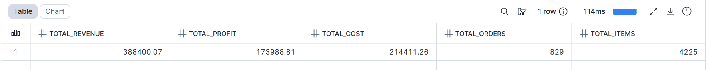

-- 1.1 Revenue total / Receta total

SELECT
    SUM(TOTAL_REVENUE) AS total_revenue,
    SUM(TOTAL_PROFIT) AS total_profit,
    SUM(TOTAL_COST) AS total_cost,
    COUNT(DISTINCT ORDER_ID) AS total_orders,
    SUM(TOTAL_ITEMS) AS total_items
FROM FCT_ORDERS
WHERE STATUS = 'completo';

